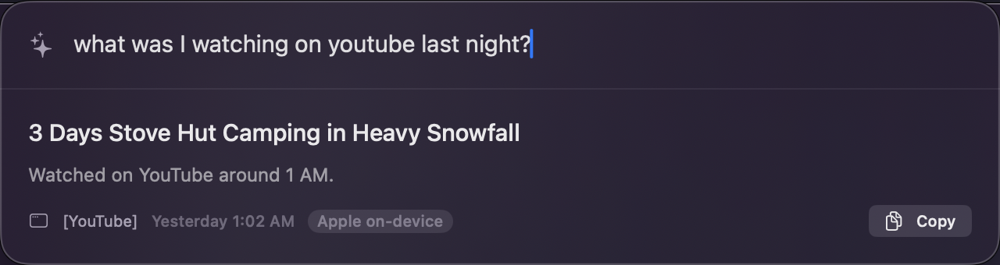

# 🧠 screenAI

> **Your On-Device Personal Intelligence Assistant for macOS.**

screenAI is a private-by-design ambient memory companion. It quietly indexes the **text** of what you see on your screen (instantly discarding pixels to protect your privacy), structures it locally using on-device OCR, and builds a searchable semantic index. 

Summon the Spotlight-style interface with `⌘⇧Space` to ask questions about your past, search your history semantically, manage commitments, or auto-fill forms from your secure, Touch-ID-locked Vault.

---

<p align="center">
  
</p>

---

## ✨ Key Features

### 🔍 Ambient Semantic Memory
* **Context-Aware Search**: Ask *"that article about burnout"* and find pages containing *"exhaustion"* or *"fatigue"*. It uses local semantic embedding vectors (`model2vec`) fused with SQLite `FTS5` full-text search.
* **Precognition**: The search panel dynamically suggests contextually relevant questions based on what is currently active on your screen and your immediate history.

### 🔄 Intelligent Page Diffs & Time Travel
* **Time-Travel Versioning**: screenAI tracks changes to page views over time, allowing you to ask *"What changed on this page since yesterday?"* and view structured text differences (diffs).

### 🤝 Automated Commitment Tracking (Promises)
* **Zero-effort Task Capture**: It automatically detects commitments made on your screen (e.g., *"I'll send the report by Friday"* in email or chat) and pins them to your **Today** dashboard until you mark them complete.

### 📈 Numbers & Sparklines
* **Automatic Metric Tracking**: Any labeled numerical data you see repeatedly (e.g., weights, grades, prices) is parsed and visualized as a local sparkline. Ask *"How has my weight trended?"* to see the chart.

### 🔒 Touch-ID Gated Vault
* **Secure Auto-Fill**: Safely store your resumes, standard answers, and personal details. Summon screenAI on any signup page to autofill forms.
* **Credentials Lock**: The Vault actively detects and refuses to index passwords or credit card details.

### 🌙 Nightly Consolidation & Digest
* **Episodes & Summaries**: Every night at 9:00 PM, screenAI groups your daily captures into structured "episodes" and generates a concise email/markdown recap of your day, highlighting loose threads and follow-ups.

---

## ⚙️ How It Works

screenAI operates on a split-architecture design:
1. **SwiftUI Frontend**: A native macOS Menu Bar App & Spotlight-style overlay handling hotkeys, dashboard widgets, and user interaction.
2. **Python Daemon**: An isolated, lightweight backend running screen capture triggers, local OCR via Apple Vision, embedding creation, local SQLite storage, and LLM coordination.

```
                  ┌─ triggers ─────────────┐
                  │ app switch · new URL   │
                  │ scroll settle · 60s HB │
                  └───────────┬────────────┘
                              ▼
                      ┌──────────────┐
                      │ screen capture│
                      └───────┬──────┘
                              ▼
                      ┌──────────────┐
                      │  Vision OCR  │
                      └───────┬──────┘
                              ▼
                      ┌──────────────┐
                      │ pixels clear │
                      └───────┬──────┘
                              ▼
                 ┌────────────┴────────────┐
                 │ model2vec semantic embed│
                 └────────────┬────────────┘
                              ▼
                     ┌────────────────┐
                     │  SQLite FTS5   │
                     │  + Vector DB   │
                     └────────────────┘
```

### Intelligent Engine Routing
When you query screenAI, it prioritizes **on-device Apple Foundation Models** (free and private). For complex reasoning tasks, it escalates up the configured chain:
$$\text{Apple On-Device} \longrightarrow \text{Claude Pro} \longrightarrow \text{ChatGPT Plus} \longrightarrow \text{Gemini (AI Studio)} \longrightarrow \text{Local Ollama}$$

---

## 🛠️ Architecture & Code Layout

| Directory / File | Description |
|---|---|
| [`screenai/`](file:///Users/chinmaysoni/Desktop/Rewisp-main/screenai/) | Python daemon (capture engine, OCR processing, vector database, HTTP API) |
| [`ui/`](file:///Users/chinmaysoni/Desktop/Rewisp-main/ui/) | SwiftUI project (native app, menu bar popover, search overlay, theme styles) |
| [`docs/`](file:///Users/chinmaysoni/Desktop/Rewisp-main/docs/) | Documentation (system manual, security auditing, briefs) |
| [`scripts/`](file:///Users/chinmaysoni/Desktop/Rewisp-main/scripts/) | Installer scripts and DMG builders |
| [`site/`](file:///Users/chinmaysoni/Desktop/Rewisp-main/site/) | Project landing page (HTML/CSS/JS) |

---

## 🚀 Setup & Installation (From Source)

### Prerequisites
* macOS 15+ (Apple Silicon recommended)
* Python 3.11+
* Hugging Face CLI (for local model downloads)

### Step-by-Step Install

1. **Clone and Navigate**:
   ```bash
   git clone https://github.com/tnshgarg/screenai.git
   cd screenai
   ```

2. **Initialize Environment & Dependencies**:
   ```bash
   python3 -m venv .venv
   source .venv/bin/activate
   pip install pytest pytest-mock pyobjc-framework-Quartz pyobjc-framework-Vision pyobjc-framework-ApplicationServices model2vec
   ```

3. **Build the SwiftUI Application**:
   ```bash
   cd ui
   ./build.sh --install
   cd ..
   ```

4. **Boot the Daemon & launchd Agents**:
   ```bash
   ./scripts/install.sh
   ```

5. **Permissions**:
   Allow **`Python`** (the daemon interpreter) and **`screenAI`** (the menu bar app) **Screen Recording** access in **System Settings** → **Privacy & Security** → **Screen & System Audio Recording**.

---

## 🔒 Privacy Core

1. **Zero-Disk Pixel Footprint**: Images are kept in memory only for OCR and immediately destroyed. Pixels are never written to disk.
2. **Strict Folder Access**: All data resides in `~/screenAI` with restricted `0700` filesystem permissions.
3. **App Kill-List**: Sensitive apps (Messages, WhatsApp, password managers) and incognito browser tabs fully pause capturing.
4. **Local-First**: Search, OCR, and embeddings run locally on your device. Only explicit, complex questions leave your device to your selected API engines.

---

## 📄 License

This project is licensed under the **MIT License**.
